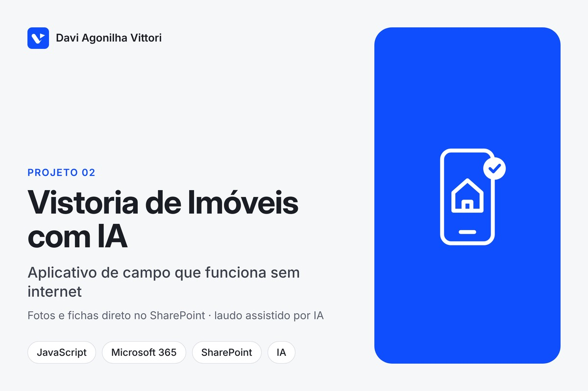
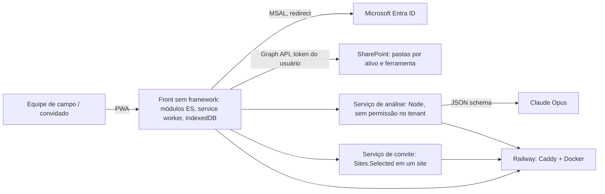

# Agente de Visitas: PWA de campo para vistoria de imóveis com análise por IA

**Tipo:** projeto para cliente (grupo do setor imobiliário), código fechado · **Período:** set–out/2026 (em produção) · **Volume:** 2 repositórios, ~280 commits

## Contexto
A equipe de campo visitava imóveis com quatro instrumentos separados (inspeção condominial,
levantamento de marketing, checklist de vistoria e consulta técnica), fotografava no celular
e montava ficha e relatório à mão depois. Informação dispersa, retrabalho e padronização
dependente de cada técnico.

## Problema
- Fotos e fichas espalhadas entre celular, e-mail e pastas; relatório manual após a visita.
- Sem sinal dentro de muitos imóveis: a ferramenta precisava funcionar offline.
- Vistoriadores externos (sem conta corporativa) precisavam participar sem ganhar acesso ao acervo.
- Identificação de materiais e revestimentos dependia da experiência individual.

## Solução
Aplicativo web instalável (PWA, mobile-first) com login corporativo, que grava fotos e fichas
diretamente no SharePoint da empresa e reúne as quatro ferramentas num roteiro de visita em
duas fases:
1. **Checklist de Vistoria** com **Análise por IA**: um chat por item avaliado; o modelo comenta
   as fotos, pede a foto que falta e emite o laudo em JSON estruturado; relatório geral gerado a
   partir dos laudos, não das fotos.
2. **Inspeção Condominial** e **Levantamento de Marketing/Conteúdo** com fichas estruturadas e
   nomenclatura padronizada de arquivos.
3. **Transcrição de conversa** no local, com extração de pontos, resumo e alertas.
4. **Convite para vistoriador externo**: código de uso único por ativo e prazo; o que o convidado
   entrega cai em **quarentena** no SharePoint até um colaborador conferir e publicar (ou devolver).
5. Fila offline em IndexedDB, service worker com aviso de nova versão, PDF da ficha no próprio aparelho.

## Arquitetura

**Stack:** JavaScript (módulos ES, sem framework nem build), PWA (service worker, IndexedDB,
manifest), MSAL (`@azure/msal-browser` com `integrity`), Microsoft Graph, SharePoint, Node.js
(serviços), Anthropic API (Claude Opus, saída em JSON schema), jsPDF, Caddy, Docker, Railway.
Segunda frente em React + TanStack Router/Start + Tailwind + Supabase (Lovable), com Capacitor
para iOS.

## Meu papel
Desenvolvedor responsável: levantamento com a equipe de campo e o administrador M365,
especificação em etapas, desenvolvimento do front, dos dois serviços e da infraestrutura,
publicação e acompanhamento com os interessados.

## Decisões técnicas relevantes
1. **Chave do modelo nunca no navegador; permissão de tenant nunca no serviço.** O navegador já
   tem o token do Graph e faz todo o acesso ao SharePoint; o serviço de análise só guarda a chave
   da Anthropic e valida a assinatura do ID token do Entra (`aud`, `tid`) antes de atender.
   Separação explícita de superfícies de risco.
2. **Serviço de convite isolado** porque é o único que precisa de permissão no tenant
   (`Sites.Selected` num site só). Convidado nunca trabalha sem alguém que o convidou, e sua
   entrega vai para quarentena; **publicar não copia bytes**, só troca o pai do arquivo no SharePoint.
3. **Sem fallback de SPA no servidor** (404 é 404): um asset ausente não pode virar "200 com a
   página inteira" e esconder defeito; `index.html`, `sw.js` e `manifest` saem com `no-cache` para
   a faixa "há uma versão nova" funcionar.
4. **Laudo em JSON schema e relatório montado dos laudos**, para o formato não depender de o
   modelo "lembrar" e para o relatório geral ser determinístico a partir das análises.
5. **Protótipo de um arquivo só** (`file://`, com Microsoft e SharePoint simulados) para validar
   caminho, textos e gestos com a equipe sem infraestrutura.
6. Dependência de CDN com `integrity` fixo e cópia no service worker: sessão restaurável sem sinal.

## Resultado
- Dez etapas do roteiro entregues e em produção (PWA instalável, login real, fila offline,
  gravação no SharePoint, análise por IA, inspeção condominial, visita em duas fases, convite).
- Vistoria completa e fotos organizadas no SharePoint ao final da visita, sem montagem manual.
- 2 repositórios, ~280 commits em 3 semanas; 2 serviços de apoio (análise e convite) e protótipo
  offline de um arquivo só para validação com a equipe.

## Evidência
O código é de propriedade do cliente e fica em repositório privado. Demonstração guiada do sistema e leitura do código podem ser feitas em uma conversa, mediante acordo de confidencialidade.
