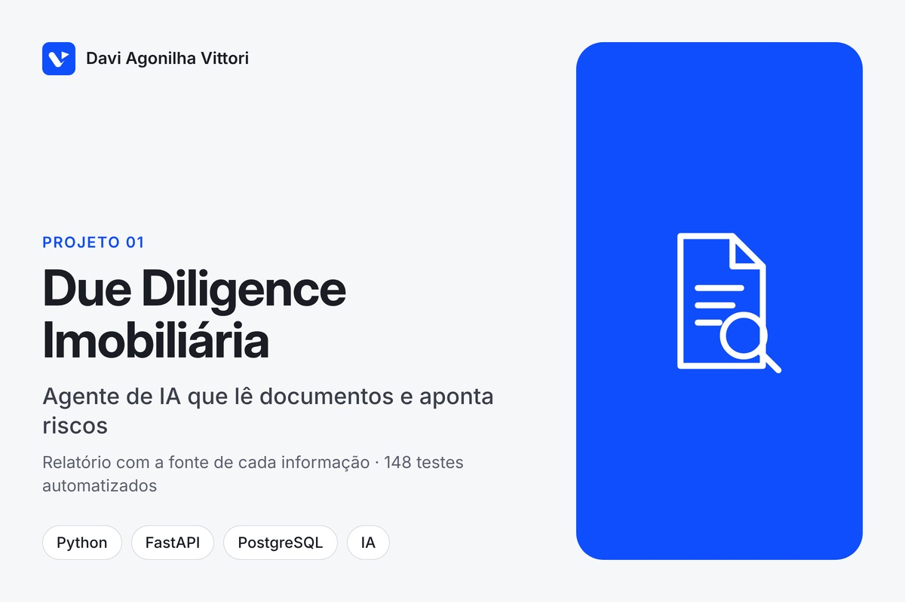
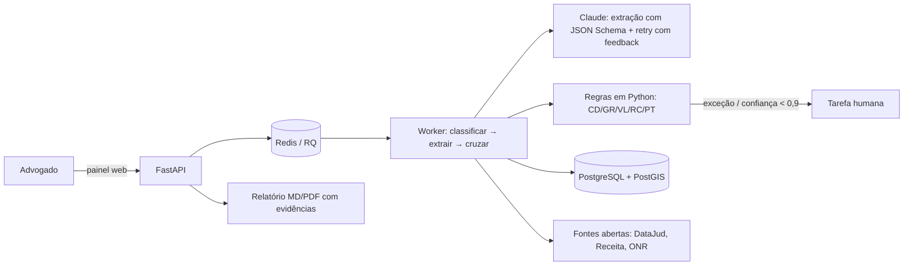

# Agente de Due Diligence Imobiliária: análise documental com proveniência e motor de regras

**Tipo:** projeto para cliente (jurídico imobiliário), código fechado · **Período:** jul–out/2026 (em produção) · **Volume:** ~400 commits, 148 arquivos de teste, 10 ADRs, CI

## Contexto
A due diligence de um imóvel exige reunir dezenas de documentos (matrícula, certidões de
distribuidores, negativas fiscais, CNPJ/QSA, documentos rurais) e ler tudo antes de o advogado
opinar. O trabalho era manual, lento e dependente de reunir arquivos de várias fontes.

## Problema
- Horas de triagem por dossiê; PDFs digitalizados e formatos heterogêneos.
- Risco de passar despercebido um ônus, uma ação ou uma certidão vencida.
- Exigência jurídica: nada no relatório sem lastro no documento; decisão sempre humana.
- Dados pessoais sensíveis (LGPD) em todo o fluxo.

## Solução
Pipeline **upload → classificação (LLM) → extração estruturada com proveniência (LLM + validação
de schema) → verificação de continuidade registral (código) → motor de regras determinístico →
pontos de atenção → relatório**. Exceções e baixa confiança viram tarefa para o advogado, na
própria linha do documento. Painel web em linguagem jurídica (glossário técnico↔jurídico só na
apresentação), login corporativo, relatório em Markdown/PDF, consulta a dados abertos
(DataJud, Receita Federal), conector para o cartório digital (ONR) com simulador e livro de
custos, sonda semanal da acessibilidade das fontes públicas.

## Arquitetura

**Stack:** Python 3.12, FastAPI, SQLAlchemy 2, PostgreSQL + PostGIS, Redis + RQ, Anthropic API
(Claude), JSON Schema, Pydantic, Shapely/pyproj (geoespacial rural), pypdf, ReportLab, MSAL
(login Microsoft Entra), Docker Compose, Railway, GitHub Actions, pytest (148 arquivos).

## Meu papel
Desenvolvedor responsável: levantamento com o jurídico (checklist, mapa de coleta de 53 tipos
de documento, vocabulário), especificação, arquitetura, código, testes, documentação (ADRs,
runbooks, política de dados) e acompanhamento das decisões de produto com os interessados.

## Decisões técnicas relevantes
1. **LLM transcreve, código decide.** Regras jurídicas, continuidade da cadeia registral e
   classificações rodam em Python testável; prompts só extraem, nunca opinam. Auditável e
   regressível por teste.
2. **Proveniência obrigatória:** toda extração carrega trecho-fonte e página; todo ponto de
   atenção carrega evidências. Nada entra no relatório sem lastro navegável até o documento.
3. **Dirigido por dados:** aplicabilidade, validade e via de coleta vivem em tabela (seed do
   mapa de coleta), não em código; ajustes não exigem deploy.
4. **Decisões humanas preservadas:** o recálculo nunca reverte SANADO / ACEITO COMO RISCO /
   FALSO POSITIVO.
5. **LGPD como guarda, não como aviso.** Após um incidente em que um diretório de escrita do
   software entrou no Git, a regra virou teste: `test_higiene_repositorio` cobra `.gitignore` +
   `.dockerignore` e varre o índice. Upload de documento pessoal é **recusado** quando a região de
   dados de qualquer destino (banco, storage, cache) não é brasileira.
6. **Nunca burlar CAPTCHA ou termos de uso**: coleta por APIs abertas, convênio ou agregador;
   o resto vai para fila humana instrumentada.
7. Vertente rural construída e **estacionada** com testes no CI quando o jurídico pivotou para
   urbano: nada removido, nada sem teste.

## Resultado
- Dossiê analisado com pontos de atenção, diligências e relatório com evidências a partir dos
  documentos que o jurídico já coleta hoje ("modo-ponte"), sem depender de integrações externas.
- 148 arquivos de teste no CI; golden set com casos reais mantido fora do repositório.
- 400 commits em 11 semanas; 53 tipos de documento mapeados (urbano e rural); 20 regras de
  cruzamento; 10 ADRs; 2 workflows de CI (testes + sonda semanal de fontes).

## Evidência
O código é de propriedade do cliente e fica em repositório privado. Demonstração guiada do sistema e leitura do código podem ser feitas em uma conversa, mediante acordo de confidencialidade.
