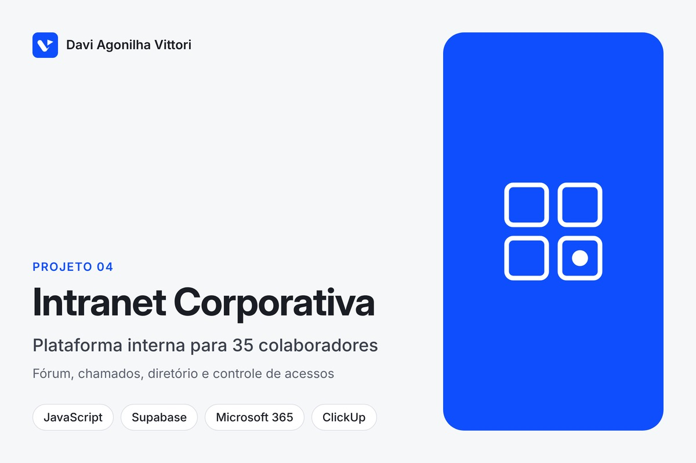
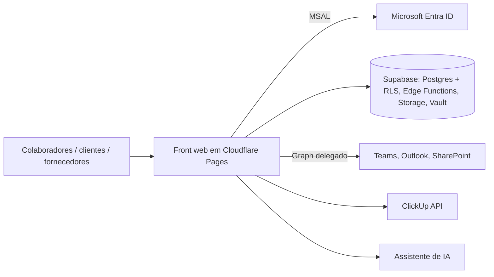

# Plataforma interna (intranet / SGI) para empresa de ~35 colaboradores

**Tipo:** projeto para cliente (grupo do setor imobiliário), código fechado · **Período:** ago–out/2026 (em produção) · **Volume:** ~1.360 commits + reescrita em andamento (~390 commits)

## Contexto
Empresa com cerca de 35 pessoas, organizada em ecossistemas (áreas) e com uma jornada de
ativos em 9 fases, operava com ferramentas espalhadas (Microsoft 365, ClickUp, planilhas,
sistemas isolados), sem ponto único de acesso, comunicação interna ou gestão de acessos.

## Problema
- Sem lugar comum: notícias, fórum, chamados e diretório viviam em canais diferentes.
- Permissões sem padrão; perfis distintos (colaborador interno, cliente/investidor, fornecedor).
- Agenda, e-mail e projetos em sistemas separados que precisavam aparecer no mesmo lugar.

## Solução
Plataforma web com login corporativo que centraliza: **Home/News**, **Fórum**, **Fale Com**
(chamados com código), **Humanograma** lendo o diretório real, **gestão de acessos** (usuários,
papéis, atribuições, políticas e auditoria), favoritos, **busca universal** em duas camadas,
**acompanhamento de projetos** (ClickUp), **agenda espelho do Teams**, e-mail via Graph,
**assistente de IA interno** e módulo de inteligência territorial.

## Arquitetura

**Stack:** JavaScript/HTML (front), Supabase (PostgreSQL com RLS, Edge Functions, Storage,
Vault), Microsoft Entra ID (MSAL), Microsoft Graph (Mail.Send, calendário), ClickUp API,
Cloudflare Pages. Reescrita em curso em React + TanStack Router/Start + Tailwind + Supabase.

## Meu papel
Desenvolvedor responsável pela plataforma: levantamento com as áreas, desenvolvimento,
modelo de dados e políticas de acesso, publicação, revisão de mudanças por pull request e
acompanhamento com os interessados.

## Decisões técnicas relevantes
1. **Segredo nunca no repositório:** chaves vivem no Vault/Secrets do Supabase; o front só
   carrega o que é público.
2. **Mudança de banco vira arquivo versionado** (`SETUP_<n>_<assunto>.sql`) com RLS, aplicado
   por uma pessoa combinada; nada muda no banco "por fora".
3. **Dois ambientes com bancos distintos** (dev/teste e produção), com promoção consciente;
   depois, consolidação deliberada num só ambiente com roteiro documentado de ida e volta.
4. **Diário e lições separados das instruções**: histórico de 34 rodadas e causas-raiz por
   classe de erro em arquivos próprios, lidos antes de mexer em CSS, permissões ou qualquer
   coisa duplicada.
5. Inventário tela a tela do build antigo antes da reescrita, para medir paridade.

## Resultado
- Plataforma em uso pelos colaboradores, com fórum, chamados, diretório, acessos e
  integrações M365/ClickUp em produção.
- ~1.360 commits em 6 semanas; 13 ecossistemas (áreas) e 3 perfis de acesso modelados;
  34 rodadas documentadas em histórico e lições; reescrita em React iniciada com inventário
  de paridade tela a tela.

## Evidência
O código é de propriedade do cliente e fica em repositório privado. Demonstração guiada do sistema e leitura do código podem ser feitas em uma conversa, mediante acordo de confidencialidade.
