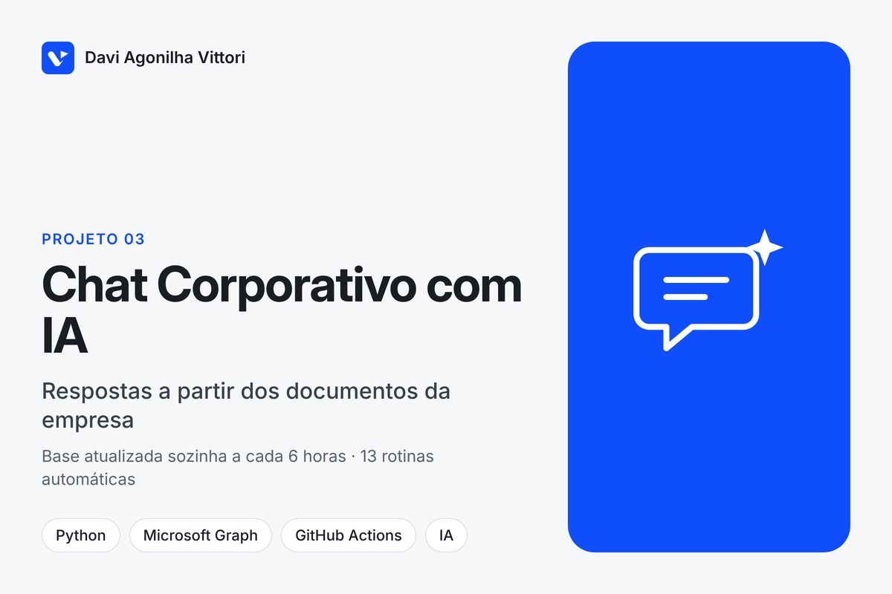
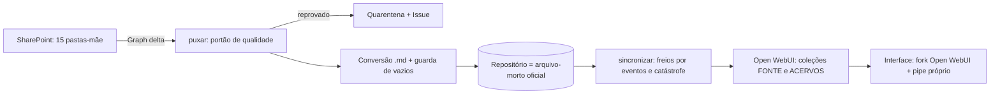

# Chat corporativo com IA sobre base de conhecimento (interface + esteira automática)

**Tipo:** projeto para cliente, código fechado · **Período:** jul–set/2026 (em produção) · **Volume:** esteira com 617 commits e 13 workflows no GitHub Actions; ~290 commits próprios sobre um fork do Open WebUI

## Contexto
A empresa queria um chat com IA que respondesse a partir do seu acervo (material institucional
e textos de referência da empresa), sem que alguém precisasse subir documentos à mão e sem
risco de a base "sumir" por um erro de sincronização.

## Problema
- Documentos nascem e mudam no SharePoint; a base do chat precisava acompanhar sozinha.
- Uma sincronização mal feita pode apagar a base inteira: o Git perdoa, a base não.
- Interface precisava da identidade da empresa, roteamento por assunto e geração de arquivos.

## Solução
Dois componentes:
1. **Esteira de conhecimento** (Python, GitHub Actions): lê o SharePoint via Graph (delta),
   aplica portão de qualidade (tipo/tamanho → quarentena com Issue automática), converte para
   Markdown com guarda contra arquivos vazios, versiona no Git e sincroniza duas coleções do
   Open WebUI. Roda a cada 6 h, com conferência diária SharePoint↔base, higiene semanal,
   backup diário e alarmes.
2. **Interface**: fork do Open WebUI com a marca da empresa e um *pipe* próprio (classificador
   de rota por assunto, gerador de arquivos, busca web, auditoria de tokens, voz/TTS).

## Arquitetura

**Stack:** Python 3.12, Microsoft Graph (app-only), GitHub Actions (13 workflows), Open WebUI
(fork; Svelte/Python), pipe em Python, TTS.

## Meu papel
Desenvolvedor responsável pela esteira e pelas customizações da interface: levantamento,
arquitetura, código, operação (runbooks, alarmes, renovação de segredos) e acompanhamento
com os interessados.

## Decisões técnicas relevantes
1. **Quem escreve na base é quem bloqueia.** O `puxar` (repo, reversível) só relata; o
   `sincronizar` (base, irreversível) tem freio por **eventos de remoção**, guarda de entrada
   (repo vazio + base cheia → aborta) e freio de **catástrofe** por fração removida, que nenhuma
   chave de confirmação vence.
2. **Falha de autenticação nunca vira "SharePoint vazio"**: aborta a rodada. Token de delta
   expirado vira resync em modo só-adicionar. Recomeço nunca remove.
3. **Nada some em silêncio**: todo arquivo barrado vai para o livro-caixa de quarentena e para
   uma Issue única com motivo em linguagem simples.
4. **Datas de expiração de segredos documentadas no repositório**, com procedimento de renovação
   e teste em dry-run antes de descartar o segredo antigo.
5. Convenções de governança (ASCII-only nos utilitários, obsoleto vai para `_arquivo`, nada é
   deletado) para operação por quem não é especialista.

## Resultado
- Base de conhecimento atualizada automaticamente a partir do SharePoint, com histórico
  versionado e zero intervenção manual no fluxo normal.
- 617 commits na esteira; 13 workflows automatizados (carga a cada 6 h, conferência diária,
  higiene semanal, backup diário, alarmes); 15 pastas-mãe do SharePoint cobertas em 2 coleções;
  ~290 commits próprios na interface.

## Evidência
O código é de propriedade do cliente e fica em repositório privado. Demonstração guiada do sistema e leitura do código podem ser feitas em uma conversa, mediante acordo de confidencialidade.
