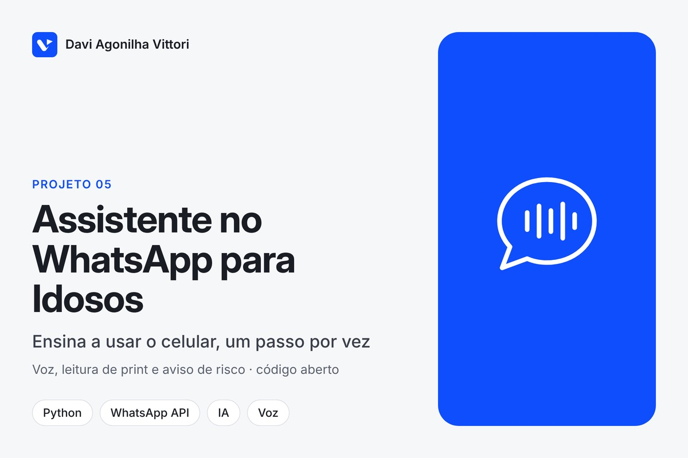
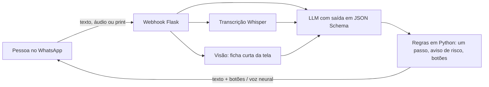

# Assistente no WhatsApp para pessoas idosas (TCC)

**Tipo:** projeto próprio, **código aberto** · **Período:** jun–set/2026 · **Código:** [davivittori/chatbot-idosos](https://github.com/davivittori/chatbot-idosos)

## Contexto
Pessoas idosas dependem de filhos e netos para tarefas simples no celular. O WhatsApp é o
aplicativo que elas já dominam, então o ensino acontece ali, sem instalar nada novo.

## Problema
- Tutoriais tradicionais despejam dez passos de uma vez e usam termos técnicos.
- Quem não sabe o nome do botão também não sabe descrever a tela.
- Algumas ações não têm volta (apagar conversa, pagar, compartilhar dado) e precisam de aviso antes.

## Solução
Assistente no WhatsApp que ensina **uma ação por mensagem**, com botões **Próximo passo** e
**Não entendi**, responde em **áudio** quando a pessoa prefere, entende **mensagens de voz** e
**prints da tela**, e avisa o risco antes de qualquer ação que custe dinheiro, exponha dados ou
não possa ser desfeita. Requisitos derivados de entrevistas com pessoas idosas (análise temática)
e de normas de acessibilidade (WCAG 2.2, ABNT NBR 17225).

## Arquitetura

**Stack:** Python 3.12, Flask, Gunicorn, WhatsApp Cloud API, Groq (LLM `gpt-oss-120b`, Whisper,
modelo de visão), edge-tts com gTTS de reserva, pytest, GitHub Actions.

## Meu papel
Projeto completo: entrevistas e levantamento de requisitos, especificação, desenvolvimento,
rodadas de teste e documentação.

## Decisões técnicas relevantes
1. **Formato imposto na decodificação** (JSON Schema): pedir "responda em JSON" errava a forma em
   cerca de uma chamada em nove.
2. **O modelo escreve, o código confere**: corte no segundo passo, botões e aviso de risco são
   regras determinísticas; se o aviso faltar, a resposta é reescrita.
3. **Imagem é contexto, não resposta**: o print vira uma ficha curta para a conversa, porque a
   pessoa já está vendo a própria tela.
4. **Webhook idempotente e memória persistente**, para reentregas da Meta e reinícios do servidor
   não quebrarem o passo a passo.

## Resultado
- Em funcionamento no WhatsApp, refinado em rodadas de teste registradas no próprio código.
- Comportamento alinhado aos requisitos RF01, RF02, RF05, RF06, RF08, RF09 e RNF01 a RNF06 do documento do TCC.
- Testes automatizados das regras determinísticas no CI.
