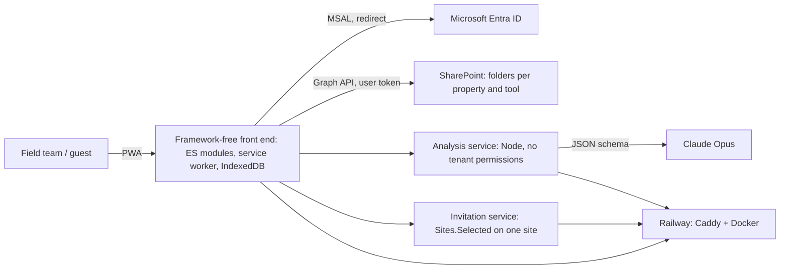

# Field Inspection Agent — offline PWA for property inspections with AI analysis

**Type:** client project (real-estate group), private code · **Period:** Sep–Oct 2026 (in production) · **Volume:** 2 repositories, ~280 commits

## Context
The field team inspected properties with four separate tools (condominium inspection, marketing
survey, inspection checklist and technical lookup), took photos on their phones and assembled
forms and reports by hand afterwards. Scattered information, rework, and quality that depended
on each inspector.

## Problem
- Photos and forms spread across phones, e-mail and folders; manual reporting after each visit.
- No signal inside many buildings: the tool had to work offline.
- External inspectors (without corporate accounts) had to take part without gaining access to the archive.
- Identifying materials and finishes depended on individual experience.

## Solution
An installable, mobile-first web app (PWA) with corporate sign-in that saves photos and forms
straight to the company's SharePoint and brings the four tools into a two-phase visit flow:
1. **Inspection checklist** with **AI analysis**: one chat per item; the model comments on the
   photos, asks for the missing shot and returns the report as structured JSON; the overall report
   is built from those item reports, not from the photos again.
2. **Condominium inspection** and **marketing/content survey** with structured forms and
   standardized file naming.
3. **On-site conversation transcription** with key points, summary and alerts.
4. **External inspector invitations**: one-time code per property and deadline; what the guest
   delivers lands in **quarantine** on SharePoint until a staff member reviews and publishes it.
5. Offline queue in IndexedDB, service worker with "new version" prompt, PDF generated on the device.

## Architecture

**Stack:** JavaScript (ES modules, no framework or build step), PWA (service worker, IndexedDB,
manifest), MSAL (`@azure/msal-browser` with `integrity`), Microsoft Graph, SharePoint, Node.js
(services), Anthropic API (Claude Opus, JSON-schema output), jsPDF, Caddy, Docker, Railway.
Second front end in React + TanStack Router/Start + Tailwind + Supabase, with Capacitor for iOS.

## My role
Lead developer: requirements with the field team and the Microsoft 365 admin, staged
specification, front end, both services and infrastructure, deployment and follow-up with
stakeholders.

## Key technical decisions
1. **Model key never in the browser; tenant permissions never in the service.** The browser
   already holds the Graph token and does all SharePoint access; the analysis service only holds
   the Anthropic key and verifies the Entra ID token signature (`aud`, `tid`) before answering.
2. **Isolated invitation service**, because it is the only component that needs tenant
   permissions (`Sites.Selected` on a single site). Guests never work unsupervised and their
   deliveries go to quarantine; **publishing copies no bytes**, it only re-parents files in SharePoint.
3. **No SPA fallback on the server** (a 404 is a 404): a missing asset must not become "200 with
   the whole page" and hide a defect; `index.html`, `sw.js` and the manifest are served `no-cache`
   so the update banner works.
4. **Item reports in JSON schema, overall report built from them**, so the format does not depend
   on the model "remembering" and the final report is deterministic.
5. **Single-file prototype** (`file://`, with Microsoft and SharePoint mocked) to validate flow,
   wording and gestures with the team before any infrastructure.
6. CDN dependency pinned with `integrity` and cached by the service worker: sessions restore offline.

## Results
- Ten planned stages delivered and in production (installable PWA, real sign-in, offline queue,
  SharePoint storage, AI analysis, condominium inspection, two-phase visit, invitations).
- Complete inspection and organized photos on SharePoint at the end of the visit, no manual assembly.
- 2 repositories, ~280 commits in 3 weeks; 2 supporting services and an offline single-file
  prototype for team validation.

## Evidence
The code belongs to the client and lives in a private repository. A guided demo and code
walkthrough can be arranged on a call, under NDA.
