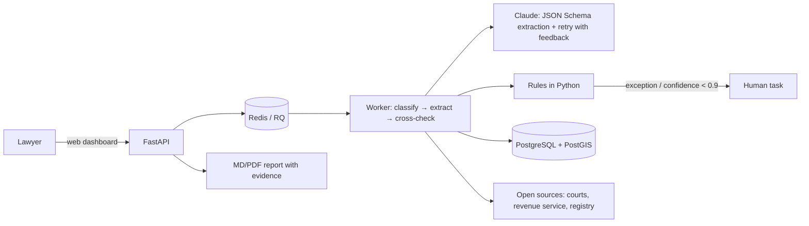

# Real-Estate Due Diligence Agent: document analysis with provenance and a rules engine

**Type:** client project (real-estate legal team), private code · **Period:** Jul–Oct 2026 (in production) · **Volume:** ~400 commits, 148 test files, 10 ADRs, CI

## Context
Due diligence on a property in Brazil means gathering dozens of documents (land registry record,
court and tax clearance certificates, company registry data, rural documents) and reading all of
them before a lawyer can give an opinion. The work was manual, slow and depended on collecting
files from many sources.

## Problem
- Hours of triage per file; scanned PDFs in heterogeneous formats.
- Risk of missing a lien, a lawsuit or an expired certificate.
- Legal requirement: nothing in the report without support in a document; decisions stay human.
- Sensitive personal data (Brazil's LGPD) throughout the flow.

## Solution
Pipeline **upload → classification (LLM) → structured extraction with provenance (LLM + schema
validation) → registry-chain continuity check (code) → deterministic rules engine → findings →
report**. Exceptions and low confidence become a task for the lawyer, on the document's own row.
Web dashboard in legal vocabulary (technical↔legal glossary only at the presentation layer),
corporate sign-in, Markdown/PDF report, open-data lookups (national court database, federal
revenue service), a connector for the digital land-registry portal with a simulator and cost
ledger, and a weekly probe of public-source availability.

## Architecture

**Stack:** Python 3.12, FastAPI, SQLAlchemy 2, PostgreSQL + PostGIS, Redis + RQ, Anthropic API
(Claude), JSON Schema, Pydantic, Shapely/pyproj (rural geospatial), pypdf, ReportLab, MSAL
(Microsoft Entra sign-in), Docker Compose, Railway, GitHub Actions, pytest (148 files).

## My role
Lead developer: requirements with the legal team (checklist, collection map of 53 document types,
vocabulary), specification, architecture, code, tests, documentation (ADRs, runbooks, data
policy) and product decisions with stakeholders.

## Key technical decisions
1. **The LLM transcribes, code decides.** Legal rules, registry-chain continuity and
   classifications run in testable Python; prompts only extract, never judge. Auditable and
   regression-tested.
2. **Mandatory provenance:** every extraction carries source excerpt and page; every finding
   carries evidence. Nothing reaches the report without a navigable link to the document.
3. **Data-driven:** applicability, validity and collection route live in a table seeded from the
   collection map, not in code; adjustments need no deploy.
4. **Human decisions are preserved:** recalculation never reverts RESOLVED / ACCEPTED AS RISK /
   FALSE POSITIVE.
5. **Privacy as a guard, not a warning.** After an incident in which a runtime write directory
   ended up in Git, the rule became a test that checks `.gitignore` + `.dockerignore` and scans
   the index. Uploads of personal documents are **refused** when any data destination (database,
   storage, cache) is outside Brazil.
6. **Never bypass CAPTCHAs or terms of use**: collection uses open APIs, agreements or a contracted
   aggregator; the rest goes to an instrumented human queue.
7. The rural branch was built and **parked** with tests still in CI when the legal team pivoted
   to urban assets: nothing removed, nothing untested.

## Results
- Files analyzed with findings, follow-up actions and an evidence-backed report from the documents
  the legal team already collects ("bridge mode"), without depending on external integrations.
- 148 test files in CI; golden set with real cases kept outside the repository.
- 400 commits in 11 weeks; 53 document types mapped; 20 cross-check rules; 10 ADRs; 2 CI workflows.

## Evidence
The code belongs to the client and lives in a private repository. A guided demo and code
walkthrough can be arranged on a call, under NDA.
