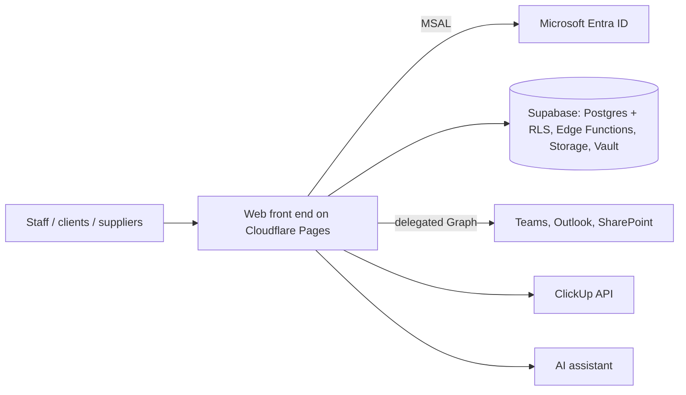

# Internal platform (intranet) for a ~35-person company

**Type:** client project (real-estate group), private code · **Period:** Aug–Oct 2026 (in production) · **Volume:** ~1,360 commits + rewrite in progress (~390 commits)

## Context
A company of about 35 people, organized in business areas and running a 9-phase asset journey,
worked across scattered tools (Microsoft 365, ClickUp, spreadsheets, isolated systems) with no
single point of access, internal communication or access management.

## Problem
- No shared space: news, forum, tickets and directory lived in different channels.
- No standard for permissions; distinct profiles (staff, client/investor, supplier).
- Calendar, e-mail and projects in separate systems that needed to show up in one place.

## Solution
Web platform with corporate sign-in that brings together: **Home/News**, **Forum**, **Help desk**
(tickets with database-generated codes), **People directory** reading the real tenant directory,
**access management** (users, roles, assignments, policies and audit), favorites, two-layer
**universal search**, **project tracking** (ClickUp), **Teams calendar mirror**, e-mail via Graph,
an **internal AI assistant** and a territorial intelligence module.

## Architecture

**Stack:** JavaScript/HTML (front end), Supabase (PostgreSQL with RLS, Edge Functions, Storage,
Vault), Microsoft Entra ID (MSAL), Microsoft Graph (Mail.Send, calendar), ClickUp API,
Cloudflare Pages. Rewrite in progress in React + TanStack Router/Start + Tailwind + Supabase.

## My role
Lead developer for the platform: requirements with each area, development, data model and access
policies, deployment, pull-request review and follow-up with stakeholders.

## Key technical decisions
1. **Secrets never in the repository:** keys live in Supabase Vault/Secrets; the front end only
   loads what is public.
2. **Every database change is a versioned file** (`SETUP_<n>_<topic>.sql`) with RLS, applied by
   an agreed person; nothing changes in the database "on the side".
3. **Two environments with separate databases** (dev/test and production) with deliberate
   promotion; later, a planned consolidation into one environment with a documented rollback path.
4. **Log and lessons kept apart from instructions**: a 34-round history and root causes grouped
   by error class, read before touching CSS, permissions or anything duplicated.
5. Screen-by-screen inventory of the old build before the rewrite, to measure parity.

## Results
- Platform in daily use, with forum, tickets, directory, access control and Microsoft 365/ClickUp
  integrations in production.
- ~1,360 commits in 6 weeks; 13 business areas and 3 access profiles modeled; 34 documented
  rounds; React rewrite started from a screen-by-screen parity inventory.

## Evidence
The code belongs to the client and lives in a private repository. A guided demo and code
walkthrough can be arranged on a call, under NDA.
