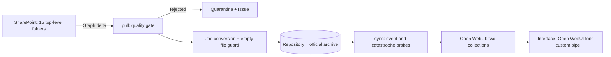

# Corporate AI chat over a knowledge base (interface + automated pipeline)

**Type:** client project, private code · **Period:** Jul–Sep 2026 (in production) · **Volume:** pipeline with 617 commits and 13 GitHub Actions workflows; ~290 own commits on an Open WebUI fork

## Context
The company wanted an AI chat that answers from its own archive (institutional material and the
founders' reference texts), without anyone uploading documents by hand and without the risk of
the knowledge base "disappearing" because of a sync error.

## Problem
- Documents are born and change in SharePoint; the chat's knowledge base had to follow on its own.
- A bad sync can wipe the whole base: Git forgives, the knowledge base does not.
- The interface needed the company's branding, topic routing and file generation.

## Solution
Two components:
1. **Knowledge pipeline** (Python, GitHub Actions): reads SharePoint through Microsoft Graph delta
   queries, applies a quality gate (type/size → quarantine with an automatic Issue), converts to
   Markdown with an empty-file guard, versions everything in Git and syncs two Open WebUI
   collections. Runs every 6 hours, with a daily SharePoint↔base reconciliation, weekly hygiene,
   daily backup and alarms.
2. **Interface**: Open WebUI fork with the company's branding and a custom *pipe* (topic router,
   file generator, web search, token auditing, voice/TTS).

## Architecture

**Stack:** Python 3.12, Microsoft Graph (app-only), GitHub Actions (13 workflows), Open WebUI
(fork; Svelte/Python), Python pipe, TTS.

## My role
Lead developer for the pipeline and the interface customizations: requirements, architecture,
code, operations (runbooks, alarms, secret rotation) and follow-up with the head of technology
and stakeholders.

## Key technical decisions
1. **Whoever writes to the base is whoever blocks.** The pull step (repository, reversible) only
   reports; the sync step (knowledge base, irreversible) has a brake on **removal events**, an
   input guard (empty repo + full base → abort) and a **catastrophe** brake on the share removed
   that no confirmation flag can override.
2. **An authentication failure never becomes "SharePoint is empty"**: the run aborts. An expired
   delta token triggers an add-only resync. A restart never removes.
3. **Nothing disappears silently**: every rejected file goes to the quarantine ledger and to a
   single Issue with the reason in plain language.
4. **Secret expiry dates documented in the repository**, with a renewal procedure and a dry-run
   test before the old secret is discarded.
5. Governance conventions (ASCII-only utilities, obsolete files archived, nothing deleted) so that
   non-specialists can operate it.

## Results
- Knowledge base updated automatically from SharePoint, with versioned history and zero manual
  steps in the normal flow.
- 617 commits in the pipeline; 13 automated workflows (6-hourly load, daily reconciliation, weekly
  hygiene, daily backup, alarms); 15 SharePoint top-level folders in 2 collections; ~290 own
  commits on the interface.

## Evidence
The code belongs to the client and lives in a private repository. A guided demo and code
walkthrough can be arranged on a call, under NDA.
