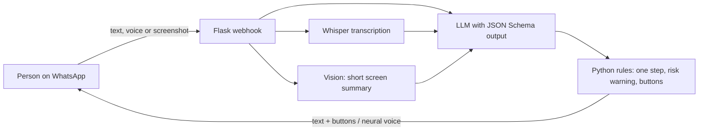

# WhatsApp assistant for older adults (final course project)

**Type:** personal project, **open source** · **Period:** Jun–Sep 2026 · **Code:** [davivittori/chatbot-idosos](https://github.com/davivittori/chatbot-idosos)

## Context
Older adults depend on children and grandchildren for simple tasks on their phones. WhatsApp is
the app they already know, so the teaching happens there, with nothing new to install.

## Problem
- Traditional tutorials dump ten steps at once and use technical terms.
- People who don't know a button's name can't describe their screen either.
- Some actions can't be undone (deleting a chat, paying, sharing data) and need a warning first.

## Solution
A WhatsApp assistant that teaches **one action per message**, with **Next step** and **I didn't
understand** buttons, answers by **voice** when the person prefers, understands **voice notes**
and **screenshots**, and warns about risk before any action that costs money, exposes data or
cannot be undone. Requirements came from interviews with older adults (thematic analysis) and
accessibility standards (WCAG 2.2, ABNT NBR 17225).

## Architecture

**Stack:** Python 3.12, Flask, Gunicorn, WhatsApp Cloud API, Groq (`gpt-oss-120b`, Whisper,
vision model), edge-tts with gTTS fallback, pytest, GitHub Actions.

## My role
Whole project: interviews and requirements, specification, development, test rounds and documentation.

## Key technical decisions
1. **Format enforced at decoding time** (JSON Schema): asking the model to "reply in JSON" got the
   shape wrong in about one call in nine.
2. **The model writes, code checks**: cutting at the second step, choosing buttons and requiring
   the risk warning are deterministic rules; if the warning is missing, the reply is rewritten.
3. **An image is context, not an answer**: the screenshot becomes a short summary for the
   conversation, because the person is already looking at their own screen.
4. **Idempotent webhook and persistent memory**, so Meta redeliveries and server restarts don't
   break a step-by-step flow.

## Results
- Running on WhatsApp, refined through test rounds recorded in the code itself.
- Behavior aligned with requirements RF01, RF02, RF05, RF06, RF08, RF09 and NFR01–NFR06 of the
  project requirements document.
- Automated tests of the deterministic rules in CI.
